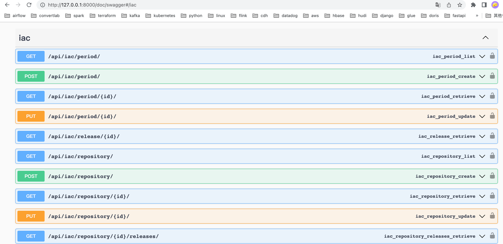
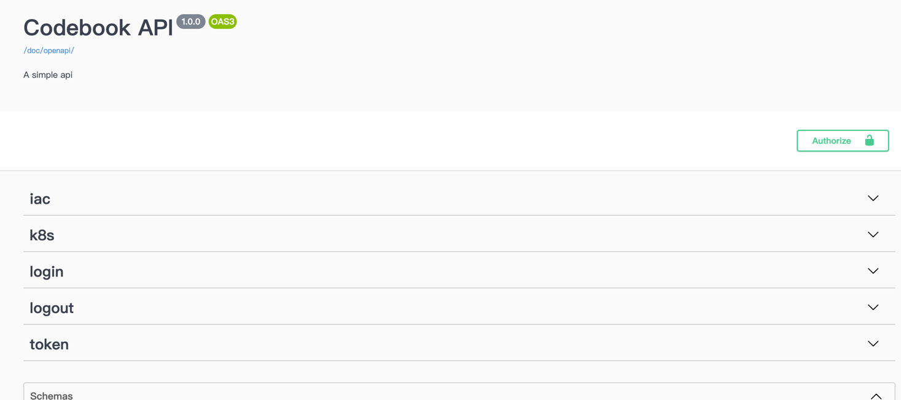
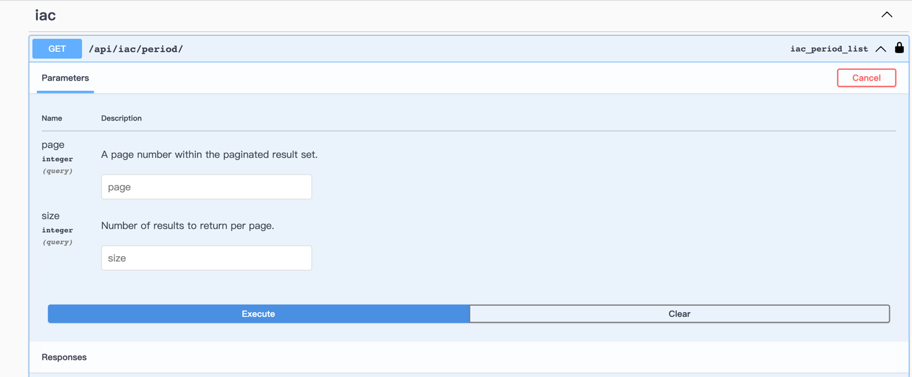
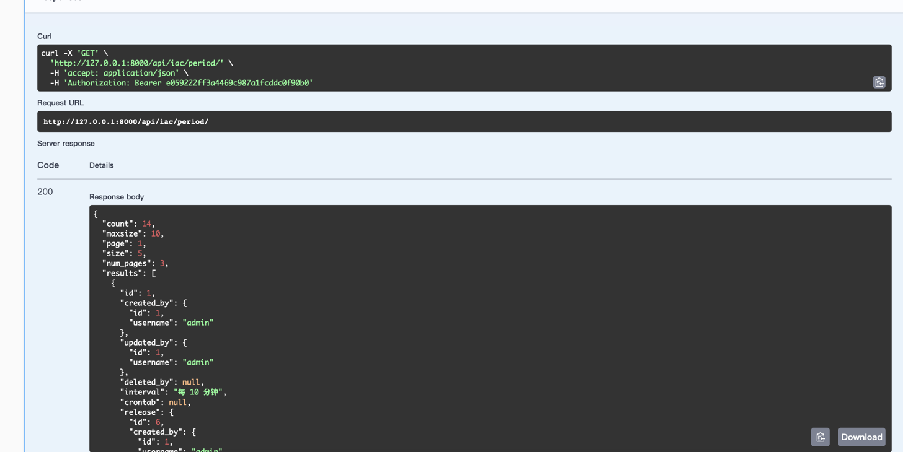

#### Overview
- 自动化运维平台,智能化管理服务器及自定义流水线进行定制化的管理CI/CD


#### Architecture

| 组件                 | 版本   |
| -------------------- | ------ |
| Python               | 3.10.2 |
| Mysql                | 5.7.28 |
| Redis                | 5.0.8  |
| Mongodb              | 5.0.14 |
| Django               | 4.0.3  |
| Django RestframeWork | 3.13.1 |
| Celery               | 5.2.3  |
| Kubernetes           | 1.25   |
| Spark                | 3.3.1  |


#### Features

1. 资产管理(CMDB)
2. 远程连接跳板机对已注册到资产管理的服务器发送命令进行管理(jumpserver)
3. Ansible集成, 支持playbook及role的模板定义. 模板文件集成git管理,代码托管在gitea平台,每次执行任务时自动从gitea平台下载对应git tag的模板代码执行ansible任务
4. Celery集成, 支持后台及并发执行ansible任务
5. 定时任务集成, 支持定时调度ansible任务
6. ansible任务执行结果及日志以websocket的方式实时返回
7. Kubernets Deployment资源管理
8. 自定义流水线支持自定义CI/CD,每条流水线按照stage拆分为不同阶段(例: 打包,测试环境发布,生产环境发布...)执行对应任务
9. CI/CD流水线任务通过celery后台运行及监控任务执行状态及报错


##### 2023/02/03

1. Kubernets ConfigMap, Service资源管理
2. 支持自定义Kubernetes Operator,以外部插件方式管理Kubernetes集群
3. park集成文件批量创建资产,暂只支持以Local方式提交任务

| 更新                                                         |
| ------------------------------------------------------------ |
| 1. 支持管理Kubernetes ConfigMap,Service资源                  |
| 2. 支持自定义Kubernetes Operator,以外部插件方式管理Kubernetes集群 |
| 3. 使用Spark集成文件批量创建资产,暂只支持以Local方式提交任务 |

| 下一阶段事项                                                 |
| ------------------------------------------------------------ |
| 集中管理Prometheus告警, 支持以短信、邮件或其他自定义方式告警 |
| 告警看板支持: 1.建立告警聚合表 2.告警ETL任务集成至Airflow Dag以T+1为调度写入至Hudi(APP层写回到Mysql) |


##### 2023/02/04

- 集成alertmanager webhook接口,告警信息支持以短信的方式进行发送

| 更新                                                         |
| ------------------------------------------------------------ |
| 集成alertmanager webhook接口,告警信息支持以短信的方式进行发送 |

| 下一阶段事项                                                 |
| ------------------------------------------------------------ |
| 告警看板支持: 1.建立告警聚合表 2.告警ETL任务集成至Airflow Dag以T+1为调度写入至Hudi(APP层写回到Mysql) |


#### API Local Doc

[goldfish API.yaml](goldfish%20API.yaml)


#### API Web Doc

`http://127.0.0.1:8000/doc/swagger`






#### API AuthToken

  POST request `http://127.0.0.1:8000/api/login/`
- body: {"username":"xxx", "password":"xxx"}
- response: { "token": "e059222ff3a4469c987a1fcddc0f90b0", "expired_time": "2023-01-28T16:33:14.886134+08:00"}


#### Configuration

settings.py
```python
DATABASES = {
    'default': {
        'ENGINE': 'django.db.backends.mysql',
        'NAME': 'xxx',
        'USER': 'xxx',
        'PASSWORD': 'xxx',
        'HOST': 'xxx',
        'PORT': '3306',
    }
}


from pathlib import Path
MEDIA_ROOT = Path("/tmp")
# ansible work dir
IAC_WORK_DIR = Path("/tmp/work")

CACHES = {
    "default": {
        "BACKEND": "django_redis.cache.RedisCache",
        "LOCATION": "redis://host:6379",
        "OPTIONS": {
            "CLIENT_CLASS": "django_redis.client.DefaultClient",
            "PASSWORD": "password",
        }
    },
    # 提供给xadmin或者admin的session存储
    "session": {
        "BACKEND": "django_redis.cache.RedisCache",
        "LOCATION": "redis://host:6379",
        "OPTIONS": {
            "CLIENT_CLASS": "django_redis.client.DefaultClient",
            "PASSWORD": "password",
        }
    },
    "celery": {
        "BACKEND": "django_redis.cache.RedisCache",
        "LOCATION": "redis://host:6379/1",
        "OPTIONS": {
            "CLIENT_CLASS": "django_redis.client.DefaultClient",
            "PASSWORD": "password",
        }
    },
}

# celery
CELERY_RESULT_BACKEND = "django-cache"
CELERY_CACHE_BACKEND = "celery"
CELERY_BROKER_URL = "redis://:password@host:6379/1"
CELERY_TASK_ROUTES = {
    "iac.tasks.*" : {"queue": "iac-1"},
    "k8s.tasks.*" : {"queue": "k8s-1"},
    "jumpserver.tasks.*" : {"queue": "jumpserver-1"},
    "alertmanager.tasks.*" : {"queue": "alertmanager-1"},
}


CHANNEL_LAYERS = {
    "default": {
        "BACKEND": "channels_redis.core.RedisChannelLayer",
        "CONFIG": {
            "hosts": ["redis://:password@host:6379/0",],
        },
    },
}

# kubernetes模板执行目录
TEMPLATE_DIR = "/Users/zyc/PycharmProjects/goldfish/k8s/k8s-files/template/hello-minikube"


MONGODB_DATABASES = {
    "name": "cmdb",
    "host": "host",
    "port": 27017,
    "tz_aware": True,
    "username": "user",
    "password": "password"
}

# 默认为当前项目根目录
JUMPSERVER_UPLOADS_DIR = BASE_DIR / "upload"

# 告警短信集成
SMS = {
    # 说明：主账号，"控制台-应用"中看到开发者主账号ACCOUNT SID
    "_accountSid":'xxx',

    # 说明：主账号Token，控制台-应用中看到开发者主账号AUTH TOKEN
    "_accountToken":'xxx',

    # 请使用管理控制台首页的APPID或自己创建应用的APPID
    "_appId":'xxx',

    # 说明：请求地址，生产环境配置成xxx.xxx.com
    "_serverIP":'xxx',

    # 说明：请求端口 ，生产环境为xxx
    "_serverPort": "xxx",
}

```


#### Start APP

```python
python3 manage.py runserver 0.0.0.0:8000
```

#### Create User

```python
python3 manage.py createsuperuser 
```


#### Start Celery

```shell
# 监听定时任务
celery -A codebox beat  -l INFO --scheduler django_celery_beat.schedulers:DatabaseScheduler

# 启动celery
celery -A codebox worker  -l INFO -Q iac-1          # ansible任务运行队列
celery -A codebox worker  -l INFO -Q k8s-1          # k8s任务运行队列
celery -A codebox worker  -l INFO -Q jumpserver-1   # spark导入资产任务运行队列
celery -A codebox worker  -l INFO -Q alertmanager-1 # 告警短信发送任务运行队列
```